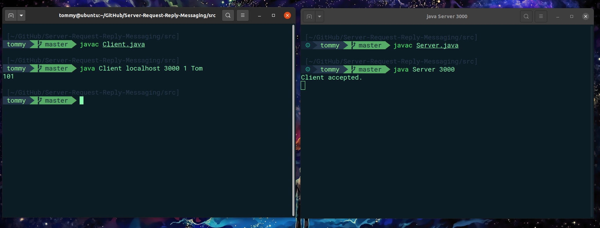
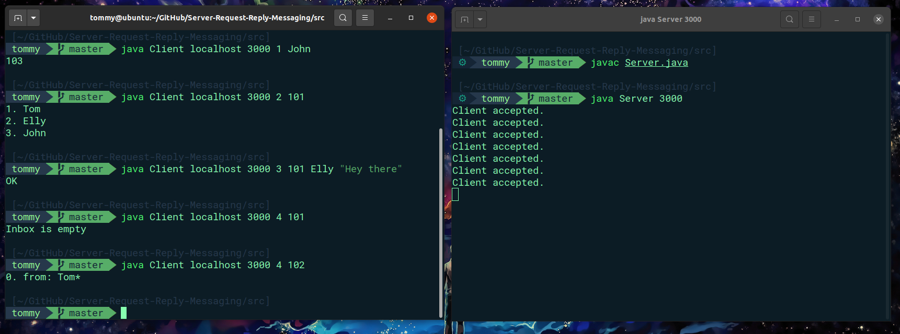
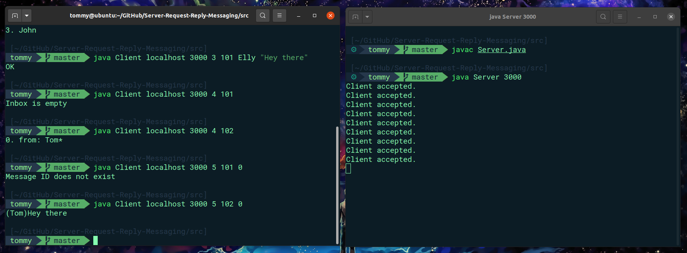

# Server Request-Reply Messaging

This program demonstrates a multi TCP/IP socket server.

## Prerequisites

Make sure that you have Java installed on your machine, and that you're using javac version 11.0.18 or later.

## Running the Program

To run the program, follow these steps:

1. Open two terminals.
2. In the first terminal, navigate to the src directory and compile Server.java using the following command:
```
javac Server.java  
```
3. In the second terminal, navigate to the src directory and compile Client.java using the following command:
```
javac Client.java
```
4. Select a portal number to use when compiling,here is an example
```
java Server 3000
```


5. Once the server is running, clients can connect to it using the assigned port number.


Here is an example of how it should look like:





## Usage

After running the server, each client is assigned a unique token that can be used to access services. The following options are available:

- Code 1: Access service
- Code 2: View account list
- Code 3: Send message to user
- Code 4: Show inbox
- Code 5: Read message
- Code 6: Delete message

Here is an example of using codes 2, 3, and 4:




As you can see, with the wrong token/key (101), it shows "Inbox is empty". Here is another example of reading a message (code 5) with the correct token/key:

